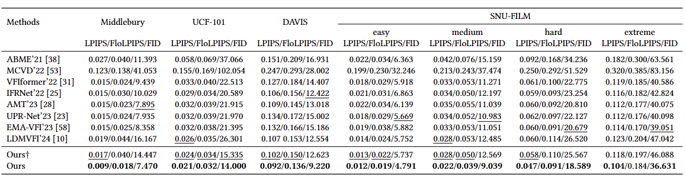

# Frame Interpolation with Consecutive Brownian Bridge

<div align="center">
  
[Zonglin Lyu](https://zonglinl.github.io/), [Ming Li](https://liming-ai.github.io/), [Jianbo Jiao](https://jianbojiao.com/), [Chen Chen](https://www.crcv.ucf.edu/chenchen/)

[](https://zonglinl.github.io/videointerp/) [](https://youtu.be/X3xcYm-qajM)  [](https://arxiv.org/abs/2405.05953)

</div>

<p align="center">

<p>

## Overview
We takes advangtage of optical flow estimation in the autoencoder part and design the Consecutive Brownian Bridge Diffusion that transits among three frames specifically for the frame interpolation task. (a)**The autoencoder with flow estimation** improves the visual quality of frames decoded from the latent space. (b) **The Consecutive Brownian Bridge Diffusion** reduce cumulative variance during sampling, which is prefered in VFI becuase there is a *deterministic groundtruth* rather than *a diverse set of images*. (c) During inference, the decoder recieves estimated latent features from the Consecutive Brownian Bridge Diffusion.

<p align="center">

<p>

## Quantitative Results
Our method achieves state-of-the-art performance in LPIPS/FloLPIPS/FID among all recent SOTAs. 
<p align="center">

<p>

## Qualitative Results
Our method achieves state-of-the-art performance in LPIPS/FloLPIPS/FID among all recent SOTAs. 
<p align="center">

<p>

For more visualizations, please refer to our <a href="https://zonglinl.github.io/videointerp/">project page</a>.

## Package Installation

```
pip install torch==2.1.0 torchvision==0.16.0 torchaudio==2.1.0 --index-url https://download.pytorch.org/whl/cu118

pip install -r requirements.txt
```


## Trained Models

The weights of of our trained model can be downloaded <a href="https://drive.google.com/file/d/1Z5kPMdYiC4CSvl1mrQLz9MqtJx7RjvrK/view?usp=sharing">here</a>.

The VQ Model (the autoencoder part of the above model) is available <a href="https://drive.google.com/file/d/1V8WS7bZe_RTCtyYZ6ZFkur8sHbKvVkT8/view?usp=sharing"> here</a>.


## Inference
**Please comment line 6 in ```utils.py``` before we provide training codes!**

**Please leave the *load_VFI* and *ckpt_path* in the config file as empty**, otherwise you need to download the model weights of VFIformer from <a href="https://drive.google.com/drive/folders/140bDl6LXPMlCqG8DZFAXB3IBCvZ7eWyv"> here</a> and our VQ Model. You need to change the path of *load_VFI* and *ckpt_path* to the path of downloaded VFIformer and our VQGAN respectively.

Please download our trained model.

Then run:

```
python interpolate.py --resume_model path_to_model_weights --frame0 path_to_the_previous_frame --frame1 path_to_the_next_frame
```
This will interpolate 7 frames in between, you may modify the code to interpolate different number of frames with a bisection like methods


## Prepare datasets

### Training set
[[Vimeo-90K]](http://toflow.csail.mit.edu/) 

### Evaluation set

[[Middlebury]](https://vision.middlebury.edu/flow/data/) | [[UCF101]](https://drive.google.com/file/d/0B7EVK8r0v71pdHBNdXB6TE1wSTQ/view?resourcekey=0-r6ihCy20h3kbgZ3ZdimPiA) | [[DAVIS]](https://drive.google.com/file/d/1tcOoF5DkxJcX7_tGaKgv1B1pQnS7b-xL/view) | [[SNU-FILM]](https://myungsub.github.io/CAIN/)

You should download *other-color-towframes.zip* and *other-gt-interp.zip* in Middlebury.

The DAVIS dataset is preprocessed with the dataset code from [LDMVFI](https://github.com/danier97/LDMVFI/blob/main/ldm/data/testsets.py) and saved in a structured file. Please feel free to directly use it, or you may use the dataloader from LDMVFI.

Data should be in the following structure:

```
└──── <data directory>/
    ├──── MidB/
    |   ├──── input/
    |   |   ├──── Beanbags/
    |   |   ├──── ...
    |   |   └──── Walking/
    |   └──── gt/
    |       ├──── Beanbags/
    |       ├──── ...
    |       └──── Walking/
    ├──── UCF/
    |   ├──── 1/
    |   ├──── 11/
    |   ├──── ...
    |   └──── 3781/
    ├──── DAVIS/
    |   ├──── bear/
    |   ├──── ...
    |   └──── walking/
    ├──── SNU-FILM/
    |   ├──── test-easy.txt
    |   ├──── ...
    |   └──── test/...
    └──── vimeo_triplet/
        ├──── sequences/
        ├──── tri_testlist.txt
        └──── tri_trainlist.txt
```

## Training and Evaluating

This part will be released after paper is accepted

## Acknowledgement

We greatfully appreaciate the source code from [BBDM](https://github.com/xuekt98/BBDM), [LDMVFI](https://github.com/danier97/LDMVFI), and [VFIformer](https://github.com/dvlab-research/VFIformer)

## Citation

If you find this repository helpful for your research, please cite:

```
@misc{lyu2024frame,
      title={Frame Interpolation with Consecutive Brownian Bridge Diffusion}, 
      author={Zonglin Lyu and Ming Li and Jianbo Jiao and Chen Chen},
      year={2024},
      eprint={2405.05953},
      archivePrefix={arXiv},
      primaryClass={cs.CV}
}
```
